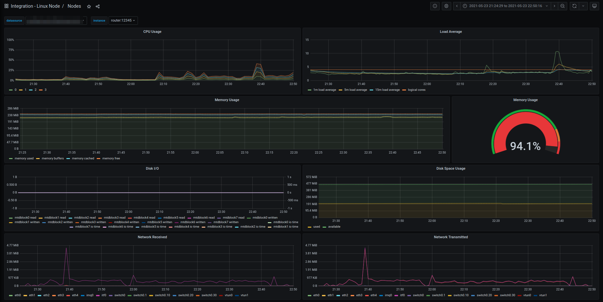

# Grafana Agent on EdgeOS

> Note: This work is in-progress. Use at your own risk!

This is a short guide for getting [Grafana Agent](https://grafana.com/docs/grafana-cloud/agent/) running on the Ubiquiti EdgeRouter platform.

Work here was highly inspired by [Monitoring EdgeRouter with Node Exporter](https://www.observability.blog/monitoring-edgerouter-with-node-exporter/), however by using Grafana Agent there's no need for a standalone Prometheus server to scrape your metrics.

## Setup

1. Enter a root shell

    ```sh
    sudo -i
    ```

2. Create the required directories

    ```sh
    mkdir -p /config/firstboot.d /config/grafana-agent
    ```

3. Fetch the grafana-agent configuration file

    ```sh
    curl -o /config/grafana-agent/grafana-agent.yaml https://raw.githubusercontent.com/marefr/grafana-agent-edgeos/main/grafana-agent/grafana-agent.yaml
    ```

4. Download the latest grafana-agent binary

    Different EdgeRouter models use either MIPS or MIPS-LE, so make sure you download the right tarball for your platform. <br>
    ER-4 is MIPS, ER-X is MIPSLE.

    > Note, currently only MIPS-LE supported.

    ```sh
    curl -fL0 https://github.com/marefr/grafana-agent-edgeos/releases/latest/download/agent-linux-mipsle.tar.gz.sha256 > /tmp/agent-linux-mipsle.tar.gz.sha256
    curl -fL0 https://github.com/marefr/grafana-agent-edgeos/releases/latest/download/agent-linux-mipsle.tar.gz > /tmp/agent-linux-mipsle.tar.gz
    cd /tmp
    sha256sum -c agent-linux-mipsle.tar.gz.sha256
    tar -zxvf agent-linux-mipsle.tar.gz
    ```

5. Move the extracted binary to `/config/grafana-agent`

    ```sh
    mv -f agent-linux-mipsle /config/grafana-agent/
    ```

6. Cleanup /tmp

    Disk space is limited on some of these devices so could be a good idea to cleanup things.

    ```sh
    rm -rf /tmp/agent-linux-mipsle*
    ```

7. Install the `Linux Server` integration in your Grafana Cloud instance

    - Follow the [guide](https://grafana.com/docs/grafana-cloud/quickstart/agent_linuxnode/)
    - In the `Run this command` instruction, extract the `GCLOUD_STACK_ID` and `GCLOUD_API_KEY` for later use as metrics username and password.

8. Install the `Loki` integration in your Grafana Cloud instance

    Follow the [guide](https://grafana.com/docs/grafana-cloud/quickstart/logs_agent_linuxnode/) to create and get a Grafana Cloud logs endpoint URL, username, password and URL.

9. Edit grafana-agent configuration

    Configure Grafana Cloud endpoint URLs, usernames and API keys for logs and metrics. See [Configuration Reference](https://github.com/grafana/agent/blob/main/docs/configuration-reference.md) for all available configuration parameters.

    ```sh
    vi /config/grafana-agent/grafana-agent.yaml
    ```

10. Start the agent manually

    > Note: Currently running the agent might hang the EdgeRouter requiring a reboot of your device. Keeping an eye of CPU and system load in the `Integration - Linux Node / Nodes` dashboard is a good idea allowing you to quit the agent if things doesn't go as expected.

    ```sh
    cd /config/grafana-agent
    ./grafana-agent -config.file ./grafana-agent.yaml -log.level debug
    ```

11. Browse dashboard and logs

    Browse the `Integration - Linux Node / Nodes` dashboard:
    

    Jump into Explore and browse logs:
    

## (Optional) systemd

EdgeOS 2.0+ is required to make use of systemd.

> Note: Currently running the agent might hang the EdgeRouter and rebooting with systemd enabled could lead to a situation where you cannot access your router. Recommended to try running the agent manually first time before installing systemd service. Use at your own risk.

1. Fetch the `grafana-agent` service scripts

    ```sh
    curl -o /config/grafana-agent/environment-file https://raw.githubusercontent.com/marefr/grafana-agent-edgeos/main/grafana-agent/environment-file
    curl -o /config/grafana-agent/grafana-agent.service https://raw.githubusercontent.com/marefr/grafana-agent-edgeos/main/grafana-agent/grafana-agent.service
    ```

2. Fetch the `grafana-agent` boot script

    This script will run every time the device have been updated with a new bootloader, i.e. firmware upgrade, and will install and enable the grafana-agent systemd service.

    ```sh
    curl -o /config/firstboot.d/grafana-agent.sh https://raw.githubusercontent.com/marefr/grafana-agent-edgeos/main/firstboot.d/grafana-agent.sh
    chmod 755 /config/firstboot.d/grafana-agent.sh
    ```

3. Run the `grafana-agent` script

    ```sh
    /config/firstboot.d/grafana-agent.sh
    ```

## Thanks

Inspiration borrowed from [tailscale-edgeos](https://github.com/jamesog/tailscale-edgeos).
